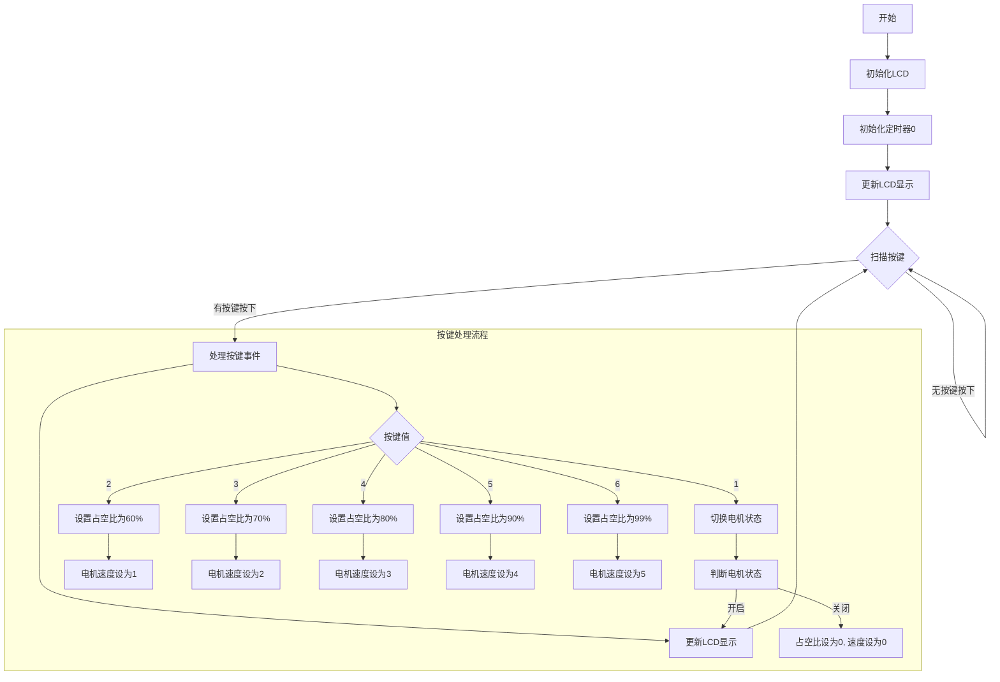

```mermaid
flowchart TD
    A[开始] --> B[初始化LCD]
    B --> C[初始化定时器0]
    C --> D[更新LCD显示]
    D --> E{扫描按键}
    E --> |无按键按下| E
    E --> |有按键按下| F[处理按键事件]
    F --> G[更新LCD显示]
    G --> E

    subgraph "按键处理流程"
        F --> H{按键值}
        H --> |1| I[切换电机状态]
        H --> |2| J[设置占空比为60%]
        H --> |3| K[设置占空比为70%]
        H --> |4| L[设置占空比为80%]
        H --> |5| M[设置占空比为90%]
        H --> |6| N[设置占空比为99%]
        I --> O[判断电机状态]
        O --> |关闭| P[占空比设为0, 速度设为0]
        O --> |开启| G
        J --> Q[电机速度设为1]
        K --> R[电机速度设为2]
        L --> S[电机速度设为3]
        M --> T[电机速度设为4]
        N --> U[电机速度设为5]
    end

```